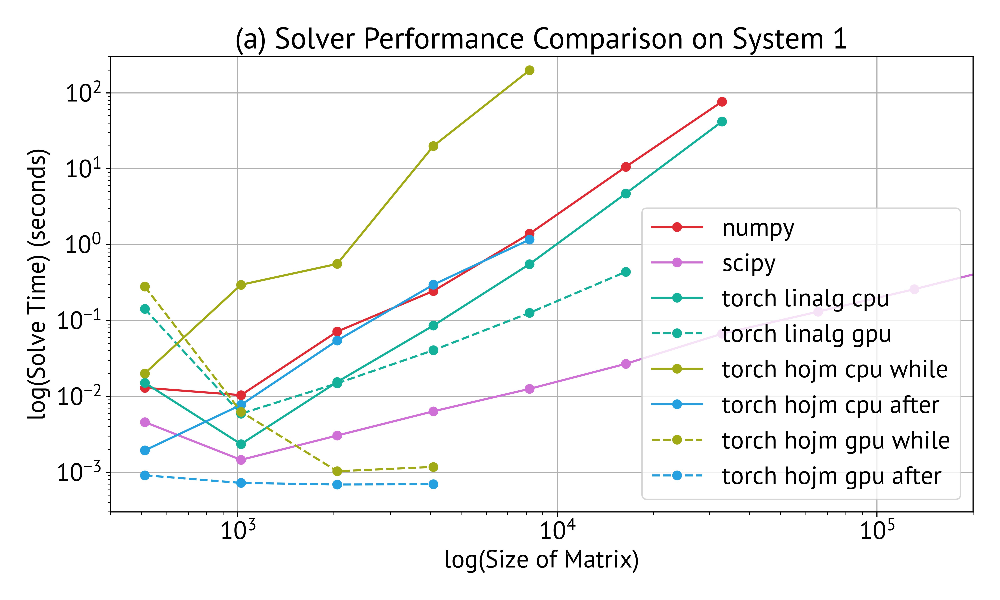
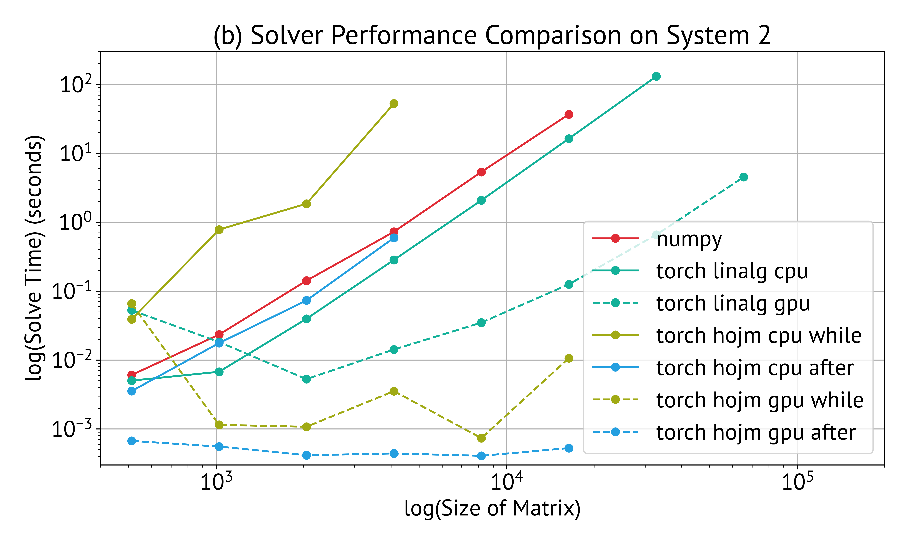
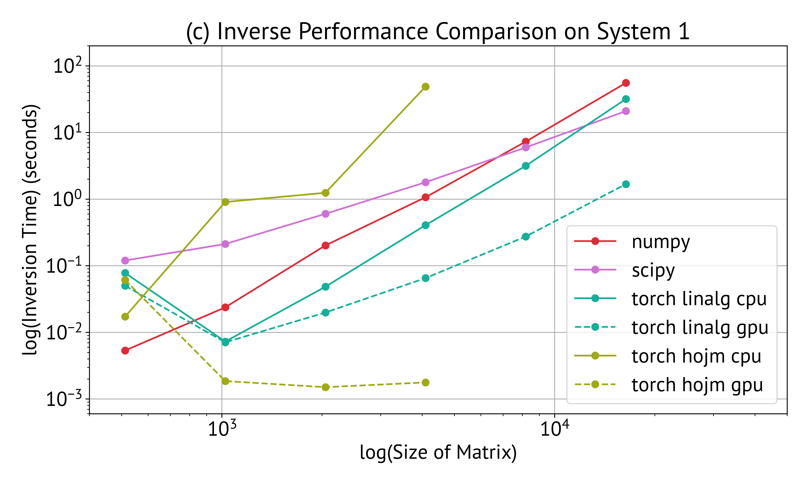
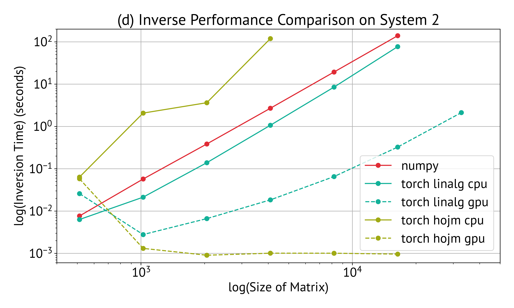

# Higher order Jacobi method for solving system of linear equations Implementation

This repository contains a PyTorch implementation and performance comparison of the Higher Order Jacobi Method (HOJM) as described in the paper: [Higher order Jacobi method for solving system of linear equations](https://arxiv.org/abs/2505.16906).

## Author
**Nithin Kumar Goona, Ph.D.**  
The University of Texas at El Paso (UTEP)  
Contact: nkgoona@utep.edu, nithin.goona@gmail.com

## Overview

The Higher Order Jacobi Method is an iterative approach for solving linear systems and computing matrix inverses. This implementation provides both the core algorithm and comprehensive performance benchmarks against standard linear algebra libraries.

## Files

- `simple_implementation.py` - Basic implementation demonstrating the HOJM algorithm
- `comparision_of_computation_times.py` - Comprehensive performance benchmarking
- `plot_results.py` - Visualization of performance comparison results

## Key Features

### Core Algorithm Functions

- `generate_coeffecients()` - Generates higher-order coefficients for the Jacobi method
- `solve_with_coeffecients()` - Solves linear systems using pre-computed coefficients  
- `find_inverse_with_coeffecients()` - Computes matrix inverse using HOJM coefficients

### Performance Comparison

The benchmarking compares HOJM against:
- NumPy `linalg.solve()` and `linalg.inv()`
- SciPy sparse linear algebra
- PyTorch CPU and GPU implementations

## Requirements

```
torch
numpy
scipy
matplotlib
pickle
```

## Usage

### Basic Example

```python
import torch
from simple_implementation import generate_coeffecients, solve_with_coeffecients

# Define a diagonally dominant matrix (required for convergence)
A = torch.tensor([[2.0, -0.1, 0.3], 
                  [0.1, 2.0, -0.2],
                  [0.3, 0.2, 1.0]], dtype=torch.float32)
b = torch.tensor([[9.0], [0.0], [-1.0]], dtype=torch.float32)

# Generate coefficients and solve
coefficients, solution = generate_coeffecients(A, b, num_iter=6, solve_while_generating=True)
print("Solution:", solution)
```

### Running Performance Benchmarks

```bash
python comparision_of_computation_times.py
python plot_results.py
```

This will generate timing results and performance plots comparing different methods.

## Algorithm Details

The Higher Order Jacobi Method works by:

1. **Decomposition**: Split matrix A into diagonal (D) and off-diagonal (A₀) components
2. **Coefficient Generation**: Iteratively compute higher-order coefficients using:
   - α = -A₀/D (initial coefficient)
   - β = b/D (initial right-hand side)
   - Recursive updates: β = (α + I)β, α = α²
3. **Solution**: Apply coefficients to solve the system or compute inverse

## Convergence Requirements

The method requires **diagonal dominance** for convergence:
- |A[i,i]| > Σ|A[i,j]| for all i ≠ j

The implementation includes examples of both diagonally dominant (convergent) and non-diagonally dominant (divergent) cases.

## Performance Characteristics

- **Training Phase**: Pre-computes coefficients (one-time cost)
- **Inference Phase**: Fast solving using pre-computed coefficients
- **GPU Acceleration**: Supports CUDA for large-scale problems
- **Memory Efficiency**: Suitable for sparse matrix problems

## Results

The benchmarking reveals performance trade-offs:
- Traditional methods especially SciPy excel for single sparse solves
- HOJM shows advantages when solving multiple systems with the same matrix
- GPU acceleration provides significant speedups for large matrices

### Performance Plots

#### Linear System Solving Performance

**Laptop System:**


**Punakha System:**


#### Matrix Inversion Performance

**Laptop System:**


**Punakha System:**


The plots demonstrate the computational complexity and performance characteristics of different methods across varying matrix sizes. The Higher Order Jacobi Method shows competitive performance, particularly for GPU implementations and scenarios involving multiple solves with the same coefficient matrix.

## License

MIT License

## Citation

If you use this implementation, please cite the original paper:
```
@article{goona2025higher,
  title={Higher order Jacobi method for solving system of linear equations},
  author={Goona, Nithin Kumar and Tarsissi, Lama},
  journal={arXiv preprint arXiv:2505.16906},
  year={2025}
}
```

## Contributing

Contributions are welcome! Please feel free to submit issues or pull requests.
